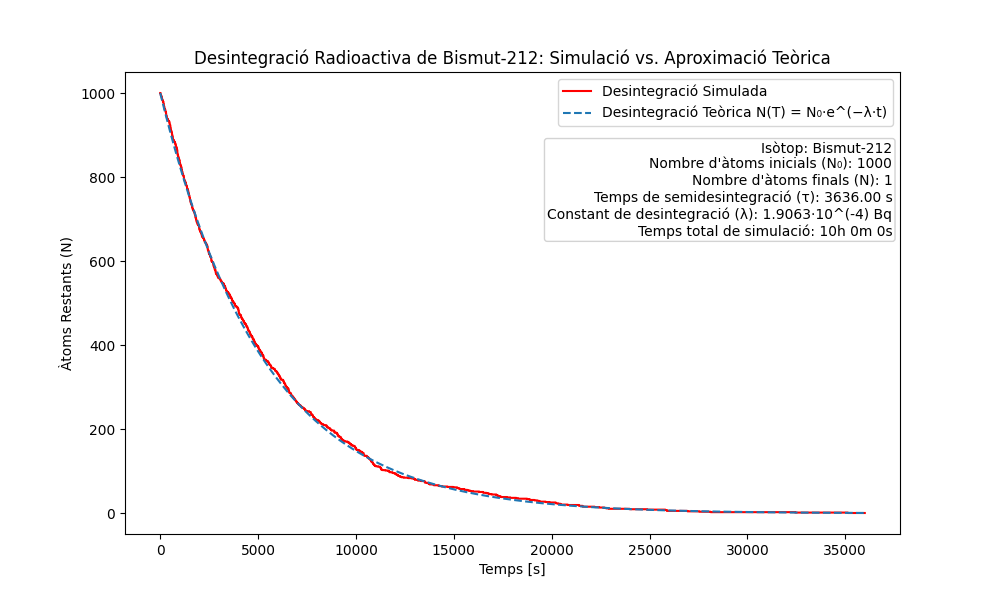

# Simulació de desintegració radioactiva
Programa que simula la desintegració radioactiva d'un element i genera la seva gràfica.

### Instal·lació
#### Es necessita Python 3.9 o versions posteriors.
Per instal·lar les dependències d'aquest projecte, executa:
```bash
# Linux/macOS
python3 -m pip install -r requirements.txt

# Windows
py -3 -m pip install -r requirements.txt
```

### Ús
Modifica `main.py` (o copia `element.py` amb `simulation.py` dins d'un altre projecte) per simular l'element desitjat.

L'exemple de `main.py` simula la desintegració del Bismut-212 (ambdues opcions són possibles, el simulador només simula la desintegració, no el tipus):
```math
^{212}_{83}\text{Bi} \rightarrow ^{208}_{81}\text{Tl} + ^{4}_{2}\alpha
```
```math
^{212}_{83}\text{Bi} \rightarrow ^{212}_{84}\text{Po} + ^{0}_{-1}\beta
```

### Classe `Element`
Informació sobre la desintegració d'un element:
- Nom de l'element (`name`: str)
- Nombre d'àtoms inicials N₀ (`N0`: int)
- Temps de semidesintegració τ (`half_life`: float)
- Constant de desintegració λ (`lambda_decay`: float)
- Temps de simulació (`time_steps`: int)
- Precisió, és a dir, quants segons per pas de simulació (`precision`: int)

> **Nota:** Pots deixar `half_life` o `lambda_decay` en blanc, un es calcula a partir de l'altre.

> **Nota:** `precision` per defecte és 1s i `time_steps` 1h.

### Simulació `simulate()`
A partir de les dades d'`Element`, simula la desintegració per cada pas de la simulació i ho compara amb la funció aproximada:
```math
N(t) = N_0 e^{-\lambda t}
```
La probabilitat de desintegració és:
```math
P(\text{desintegració}) = P(\lambda \cdot \text{precision})
```
> **Nota:** La funció per defecte obre una nova pestanya amb la gràfica. Aquesta opció es pot desactivar amb `show_plot=False`.

> **Nota:** Un cop acabada la simulació, les dades es guarden a `./saved_simulations/name/index/`. Aquí trobaràs `metadata.json` (informació de la classe `Element`), `simulation.png` (la gràfica) i `simulation_data.csv` (el fitxer Excel amb les dades de la simulació graficada).

Aquí pots veure una gràfica obtinguda per aquesta funció (amb l'exemple del bismut anterior):

